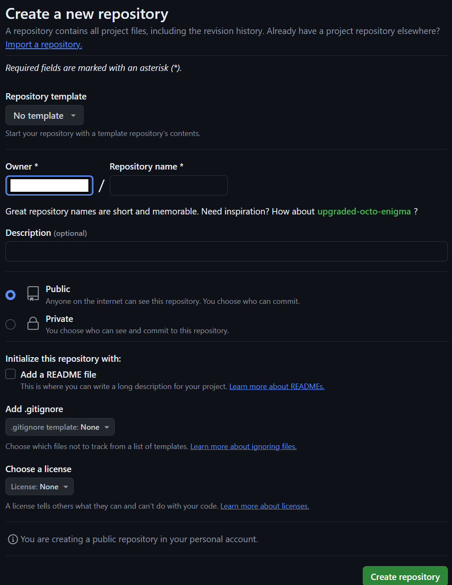

# Git and GitHub

---

## Description

The objective of this assignment is to familiarize yourself with basic Git commands and working with GitHub. You will create a local repository, make changes, commit those changes, and push them to a remote repository on GitHub.

## Learning Outcomes

- understand basic git commands
- create and manage local repositories
- create and manage GitHub repositories
- file and version control

---

## ToDo list ✅

[ ] Open your terminal (Command Prompt, Git Bash, etc.) and navigate to the directory where you want to create your repository using the cd command. Create a new directory named git-practice for your project, `cd` into it, and open vscode by running (one at a time):

```
mkdir git-practice
cd git-practice
code .
```

[ ] To initialize a new Git repository, run the command git init inside your git-practice directory. This will create a new .git subdirectory, which contains all the necessary metadata for your Git repository.

```
git init
```

[ ] create a new file called hello.txt and add `hello world` to it.

[ ] To see the current state of your repository and the changes you’ve made, use the command:

```
git status
```

[ ] Add all files to the staging area by running:

```
git add .
```

[ ] run `git status` one more time to see the difference in the current state of your repository.

[ ] Commit the changes with a meaningful message using:

```
git commit -m "Add hello.txt with a greeting message"
```

[ ] Go to GitHub and log in to your account. Click on the + icon in the top right corner and select New repository. Name your repository git-practice, add a description if you like, and do not initialize the repository with a README file. Click Create repository to finish. Then click the commands under `push an existing repository` and paste them in your local repository's terminal to push your changes to GitHub.





[ ] Go to your GitHub repository page and refresh it. You should see the hello.txt file with the content you added. This confirms that your local repository has been successfully pushed to GitHub.

[ ] Modify `hello.txt`: Add another line of your choosing and then repeat the previous steps:

```
git add .
git commit -m "Update hello.txt"
git push origin main
```

[ ] Verify your changes made it to GitHub by refreshing the page.